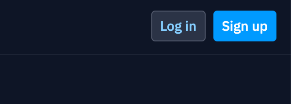
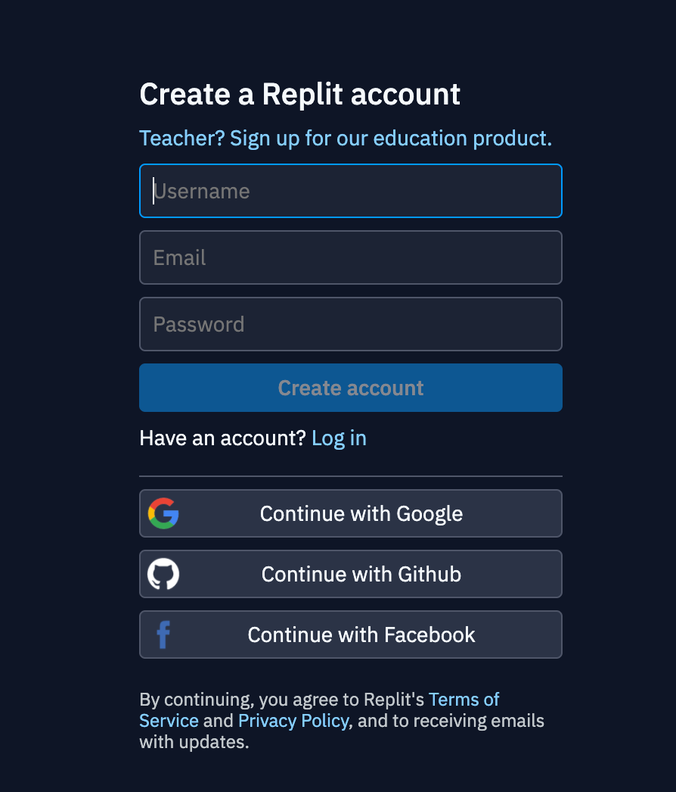
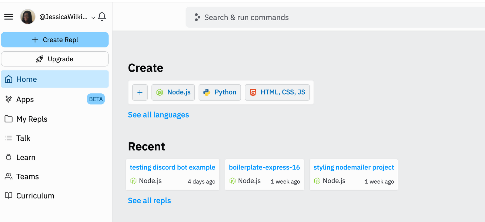

Первоисточник: https://core.telegram.org/bots/tutorial

# Получи свой токен бота

В нашем случае, токен - это особая последовательность символов, что-то вроде пароля от бота, который позволяет платформе Telegram понять, что твоя программа отвечает за поведение конкретного бота. Каждый бот имеет свой уникальный токен, который всегда можно получить или перевыпустить через бота @BotFather.

Чтобы получить токен, откройте диалог с @BotFather, введите команду /newbot и следуйте предлагаемым шагам до самого конца.

Тебе будет предложено:

 - Выбрать **name** — отображаемое имя бота, может быть любым (в разумных пределах)
 - Выбрать **username** — системный индентификатор бота, должен быть уникальным, нельзя поменять, кроме как создав нового бота. Должно заканчиваться на "bot" и состоять только из латинских символов, цифр и нижних подчёркиваний.

Полученный токен будет похож на это:
```
4839574812:AAFD39kkdpWt3ywyRZergyOLMaJhac60qc
```

> Убедись, что хранишь токен в надёжном месте, относись к нему как к паролю и не делись ни с кем.

# Зарегистрируйся на 
Для начала надо зайти на главную страницу . В верхнем правом углу будет кнопка "Sign Up" (зарегистрироваться).



Можно создать со своими собственными именем пользователя (username), адресом почты (email) и паролем (password). Или можно использовать свой готовый аккаунт Google, Facebook или GitHub.



Как только вы залогинитесь, вы увидите домашнюю страницу пользователя:



# Создать репл

Чтобы создать репл (проект), зайдите на домашнюю страницу пользователя ([https://replit.com/~]) и нажмите кнопку "Сreate Repl" в боковом меню.

![create-repl.gif]

To create one, navigate to Replit and click the create button in the sidebar.

create a Repl

Next, give your Repl a name and choose the Template you want to use. 
